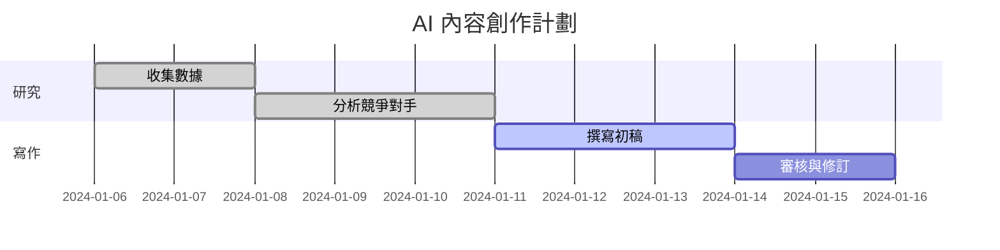

# 實驗 2：建構層級式 Crew 與視覺化計劃

## 第一部分：運行並分析基礎範例

1.  **導航至範例目錄：**
    ```bash
    cd ../examples/manager_agent_planning
    ```
2.  **設定您的 API 金鑰：**
    -   打開 `main.py` 並設定您的 OpenAI API 金鑰。
3.  **運行腳本：**
    ```bash
    python main.py
    ```
4.  **分析輸出：**
    -   這是本實驗最關鍵的部分。仔細跟隨 `verbose=2` 的日誌。
    -   **識別計劃**：在日誌的開頭，找到 `Content Planner` 代理的「Thought」部分。它應該會列出一個清晰的、多步驟的計劃。請將這個計劃複製下來。
    -   **追蹤委派**：觀察 `Content Planner` 如何將計劃中的每個步驟轉化為新的任務，並將它們委派給 `Researcher` 和 `Writer`。
    -   **觀察審核**：注意 `Content Planner` 在專家代理完成工作後，是如何審查其輸出並決定下一步行動的。

## 第二部分：修改主題與團隊

1.  **更改報告主題：**
    -   在 `main.py` 中，找到 `plan_and_write_task`。
    -   將 `description` 中的主題從 "the importance of AI in modern education" 更改為一個您感興趣的、更複雜的主題。例如："the impact of renewable energy on the global economy" 或 "the future of space exploration"。

2.  **(可選) 新增一個專家代理：**
    -   設想一個可以幫助您完成新主題的角色。例如，如果您選擇了經濟相關主題，可以創建一個 `Economist` 代理。
    -   `role`: "Financial Analyst"
    -   `goal`: "Analyze and interpret financial data related to the topic."
    -   `backstory`: "An expert in economic modeling and financial forecasting."
    -   將這個新代理加入 `project_crew` 的 `agents` 列表中。
    -   重新運行腳本。觀察 `planner` 是否能夠識別並利用這個新的專家代理。

## 第三部分：交付成果 - 視覺化您的計劃

您的主要交付成果不是程式碼，而是對 AI 所產生計劃的理解。

1.  **提取計劃**：從您在第一部分或第二部分運行的日誌中，提取出 `planner` 所制定的多步驟計劃。
2.  **創建甘特圖**：
    -   使用任何您喜歡的工具（例如 Mermaid.js, Google Sheets, Microsoft Project, 或一個簡單的 Markdown 表格）來創建一個甘特圖。
    -   **任務列表**：圖表應列出 `planner` 制定的所有子任務。
    -   **依賴關係**：如果一個任務依賴於另一個任務的完成（例如，寫作依賴於研究），請用箭頭或縮排來表示這種關係。
    -   **代理分配**：標示出每個任務被分配給了哪個代理 (`Researcher`, `Writer`, 等)。

**範例 (使用 Mermaid.js):**



提交您的甘特圖（可以是圖片或程式碼），以證明您已成功地將 AI 的動態規劃過程進行了解構與視覺化。


