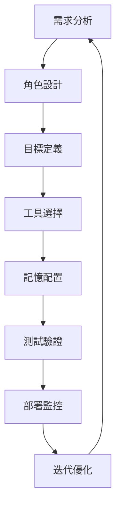

# 🤖 Agent 核心模組 Fundamentals

> **基於 First Principles、Fundamentals 和 Body of Knowledge 的 CrewAI Agent 設計與實作指南**

## 📋 概述

本文檔基於工程領域的三大知識框架，深入解析 CrewAI Agent 的核心設計原理與實作方法，旨在為開發者提供快速入門的核心知識點，並結合理論與實務進行整合應用說明。

### 框架對照表

| 知識框架 | 在 Agent 設計中的應用 | 優點 | 潛在盲區 |
|---------|---------------------|------|----------|
| **First Principles** | 回歸 Agent 的本質定義，從最基本的自主性、互動性、反應性出發 | 確保設計符合 AI Agent 的核心特性 | 可能忽略實際工程約束 |
| **Fundamentals** | 掌握 Agent 的角色、目標、工具、記憶四大基礎要素 | 直觀易懂，快速上手 | 不同專案對基礎要素的定義可能不一致 |
| **Body of Knowledge** | 對照 Multi-Agent Systems、Cognitive Architecture 等學術框架 | 具備理論完備性和學術背書 | 內容龐雜，不利於快速開發 |

---

## 🎯 First Principles: Agent 的本質特性

### 1. 自主性 (Autonomy)
**定理**: Agent 必須能夠在最小化人工干預的情況下操作
```python
# 實作原理：Agent 具備獨立的執行循環
class BaseAgent:
    def autonomous_execution_loop(self):
        while self.should_continue():
            task = self.get_next_task()
            result = self.execute(task)
            self.update_state(result)
```

**潛在盲區**: 
- 過度自主可能導致不可預測的行為
- 需要適當的約束機制和監控

### 2. 互動性 (Interactivity) 
**定理**: Agent 必須能夠與環境、用戶和其他 Agent 進行有效溝通
```python
# 實作原理：標準化的訊息傳遞介面
class CommunicationInterface:
    def send_message(self, target: str, message: Dict[str, Any])
    def receive_message(self) -> Dict[str, Any]
    def broadcast(self, message: Dict[str, Any])
```

### 3. 反應性 (Reactivity)
**定理**: Agent 必須能夠感知環境變化並及時響應
```python
# 實作原理：事件驅動的狀態管理
class ReactiveAgent(BaseAgent):
    def on_environment_change(self, change_event):
        if self.should_react_to(change_event):
            self.adapt_behavior(change_event)
```

### 4. 主動性 (Proactivity)
**定理**: Agent 必須能夠主動追求目標，而非僅被動回應
```python
# 實作原理：目標導向的行為規劃
class ProactiveAgent(BaseAgent):
    def goal_pursuit_cycle(self):
        current_state = self.assess_current_state()
        gap = self.calculate_goal_gap(current_state)
        actions = self.plan_actions_to_close_gap(gap)
        self.execute_actions(actions)
```

---

## 🏗️ Fundamentals: Agent 的四大基礎要素

### 1. 角色定義 (Role Definition)

**核心概念**: 角色是 Agent 的身份基礎，決定其思維模式和行為特徵

**實作要點**:
```python
class AgentConfig(BaseModel):
    role: str = Field(..., min_length=3, description="明確的角色定義")
    
    @validator('role')
    def validate_role_specificity(cls, v):
        # 角色應該具備足夠的專業性和特異性
        generic_roles = ["助手", "AI", "機器人"]
        if any(generic in v for generic in generic_roles):
            raise ValueError("角色定義過於泛化，應具備專業特性")
        return v
```

**最佳實踐**:
- ✅ **具體化**: "資深 Python 架構師" vs ❌ "程式設計師"
- ✅ **領域化**: "金融風險分析師" vs ❌ "分析師" 
- ✅ **層級化**: "技術主管" vs ❌ "技術人員"

**潛在盲區**:
- 角色過於狹窄可能限制 Agent 的適應性
- 角色衝突時缺乏優先級機制

### 2. 目標驅動 (Goal-Oriented)

**核心概念**: 目標是 Agent 行為的最終導向，必須明確、可測量、可達成

**SMART 目標框架應用**:
```python
class GoalValidator:
    @staticmethod
    def validate_smart_goal(goal: str) -> Dict[str, bool]:
        return {
            "specific": GoalValidator._is_specific(goal),
            "measurable": GoalValidator._is_measurable(goal), 
            "achievable": GoalValidator._is_achievable(goal),
            "relevant": GoalValidator._is_relevant(goal),
            "timebound": GoalValidator._is_timebound(goal)
        }
```

**實作模式**:
```python
# 層次化目標系統
class HierarchicalGoals:
    primary_goal: str      # 主要目標
    sub_goals: List[str]   # 子目標
    constraints: List[str] # 約束條件
    success_criteria: List[str] # 成功標準
```

**適用性分析**:
- 🎯 **高適用**: 任務導向、結果明確的場景
- ⚠️ **中適用**: 探索性、創新性任務（目標可能動態調整）
- ❌ **低適用**: 完全開放式、無明確終點的任務

### 3. 工具整合 (Tool Integration)

**核心概念**: 工具是 Agent 能力的延伸，實現與外部系統的交互

**工具分類體系**:
```python
class ToolCategory(Enum):
    INFORMATION_RETRIEVAL = "資訊檢索"    # 搜尋、爬蟲、API
    DATA_PROCESSING = "資料處理"          # 分析、轉換、計算
    COMMUNICATION = "溝通協作"            # 郵件、訊息、通知
    CONTENT_CREATION = "內容創作"         # 文件、圖片、影片
    SYSTEM_INTEGRATION = "系統整合"       # 資料庫、檔案、服務
```

**容錯機制設計**:
```python
class RobustToolWrapper:
    def __init__(self, tool: BaseTool, fallback_strategy: str = "graceful_degradation"):
        self.tool = tool
        self.fallback_strategy = fallback_strategy
        self.retry_count = 0
        self.max_retries = 3
    
    async def execute_with_fallback(self, *args, **kwargs):
        for attempt in range(self.max_retries):
            try:
                return await self.tool.execute(*args, **kwargs)
            except Exception as e:
                self.retry_count += 1
                if attempt == self.max_retries - 1:
                    return self._apply_fallback_strategy(e)
                await asyncio.sleep(2 ** attempt)  # 指數退避
```

**潛在盲區**:
- 工具依賴過重可能影響 Agent 的獨立性
- 工具版本變更可能導致相容性問題
- 多工具協調時的衝突處理

### 4. 記憶管理 (Memory Management)

**核心概念**: 記憶是 Agent 學習和適應的基礎，包含短期、長期和情境記憶

**記憶層次架構**:
```python
class MemoryArchitecture:
    # 短期記憶：當前會話的臨時資訊
    working_memory: Dict[str, Any] = {}
    
    # 長期記憶：持久化的經驗和知識
    long_term_memory: PersistentStorage = None
    
    # 情境記憶：特定場景的專業知識
    episodic_memory: List[Episode] = []
    
    def consolidate_memory(self):
        """將重要的短期記憶轉移到長期記憶"""
        important_items = self._identify_important_memories()
        for item in important_items:
            self.long_term_memory.store(item)
```

**記憶檢索策略**:
```python
class MemoryRetrieval:
    def semantic_search(self, query: str, top_k: int = 5) -> List[Memory]:
        """基於語義相似度的記憶檢索"""
        pass
    
    def temporal_search(self, time_range: Tuple[datetime, datetime]) -> List[Memory]:
        """基於時間範圍的記憶檢索"""
        pass
    
    def contextual_search(self, context: Dict[str, Any]) -> List[Memory]:
        """基於情境的記憶檢索"""
        pass
```

---

## 📚 Body of Knowledge: 學術框架對照

### 1. Multi-Agent Systems (MAS) 對照

**學術定義**: MAS 是由多個相互作用的自主 Agent 組成的系統

**CrewAI 實作對照**:
```python
# MAS 特性實作
class MultiAgentSystem:
    def __init__(self):
        self.agents: List[BaseAgent] = []
        self.communication_protocol = ACLProtocol()
        self.coordination_mechanism = CoordinationManager()
        self.conflict_resolution = ConflictResolver()
    
    def add_agent(self, agent: BaseAgent):
        """符合 MAS 的動態組成特性"""
        self.agents.append(agent)
        self.coordination_mechanism.register_agent(agent)
    
    def facilitate_interaction(self, sender: str, receiver: str, message: Dict):
        """符合 MAS 的互動通訊特性"""
        self.communication_protocol.send_message(sender, receiver, message)
```

### 2. Cognitive Architecture 對照

**學術基礎**: 基於認知科學的心智模型，如 ACT-R、SOAR

**CrewAI 認知模組實作**:
```python
class CognitiveAgent(BaseAgent):
    def __init__(self, config: AgentConfig):
        super().__init__(config)
        
        # 認知架構組件
        self.perception_module = PerceptionModule()
        self.reasoning_engine = ReasoningEngine() 
        self.learning_system = LearningSystem()
        self.action_selection = ActionSelection()
    
    def cognitive_cycle(self, input_stimuli):
        """實作認知循環：感知→推理→學習→行動"""
        perception = self.perception_module.process(input_stimuli)
        reasoning_result = self.reasoning_engine.reason(perception)
        learning_update = self.learning_system.update(reasoning_result)
        action = self.action_selection.select(reasoning_result)
        return action
```

### 3. Agent Communication Language (ACL) 對照

**學術標準**: FIPA-ACL 國際標準

**CrewAI 通訊實作**:
```python
class FIPACompliantMessage:
    def __init__(self):
        self.performative: str = ""  # inform, request, agree, refuse 等
        self.sender: str = ""
        self.receiver: str = ""
        self.content: Any = None
        self.language: str = "JSON"
        self.ontology: str = "CrewAI-Ontology"
        self.protocol: str = "FIPA-REQUEST"
        self.conversation_id: str = ""
        self.reply_with: str = ""
        self.in_reply_to: str = ""
```

---

## ⚠️ 潛在盲區與適用性分析

### 1. 設計盲區

#### 過度工程化
**問題**: 追求理論完備性導致系統過於複雜
```python
# ❌ 過度複雜的設計
class OverEngineeredAgent:
    def __init__(self):
        self.cognitive_architecture = ComplexCognitiveSystem()
        self.multi_layer_memory = SevenLayerMemorySystem()
        self.advanced_reasoning = QuantumReasoningEngine()
        # ... 過多不必要的組件

# ✅ 簡潔實用的設計  
class PragmaticAgent:
    def __init__(self, role: str, goal: str, tools: List[BaseTool]):
        self.role = role
        self.goal = goal
        self.tools = tools
        self.memory = SimpleMemoryStore()
```

#### 單點故障
**問題**: 關鍵組件無備援機制
```python
# ✅ 容錯設計
class ResilientAgent(BaseAgent):
    def __init__(self, config: AgentConfig):
        super().__init__(config)
        self.primary_llm = PrimaryLLM()
        self.fallback_llm = FallbackLLM()  # 備援語言模型
        self.circuit_breaker = CircuitBreaker()  # 熔斷器模式
```

### 2. 適用性矩陣

| 應用場景 | 適用度 | 推薦配置 | 注意事項 |
|---------|--------|----------|----------|
| **自動化客服** | 🟢 高 | 專業化 Agent + 豐富工具 | 需要完善的異常處理 |
| **內容創作** | 🟢 高 | 創意型 Agent + 反思機制 | 品質評估標準化困難 |
| **數據分析** | 🟢 高 | 分析師 Agent + 專業工具 | 需要領域知識整合 |
| **專案管理** | 🟡 中 | 管理型 Agent + 協調工具 | 人機協作界面重要 |
| **創新研發** | 🟡 中 | 探索型 Agent + 學習能力 | 目標可能需要動態調整 |
| **高風險決策** | 🔴 低 | 輔助型 Agent + 人工確認 | 不適合完全自動化 |

### 3. 性能考量

#### 記憶體管理
```python
class MemoryEfficientAgent(BaseAgent):
    def __init__(self, config: AgentConfig):
        super().__init__(config)
        self.memory_limit = config.memory_limit or 1000  # 限制記憶條目數
        self.compression_strategy = "semantic_clustering"
    
    def manage_memory_overflow(self):
        """記憶體溢出管理"""
        if len(self.execution_history) > self.memory_limit:
            compressed_history = self.compress_old_memories()
            self.execution_history = compressed_history
```

#### 並發處理
```python
class ConcurrentAgent(BaseAgent):
    async def handle_multiple_tasks(self, tasks: List[str]):
        """並發處理多個任務"""
        semaphore = asyncio.Semaphore(5)  # 限制並發數
        
        async def process_task(task):
            async with semaphore:
                return await self.execute_task_async(task)
        
        results = await asyncio.gather(*[process_task(task) for task in tasks])
        return results
```

---

## 🛠️ 實務整合指南

### 1. 開發流程



### 2. 最佳實踐檢查清單

#### 設計階段
- [ ] 角色定義是否具備專業特性？
- [ ] 目標是否符合 SMART 原則？
- [ ] 工具選擇是否覆蓋核心功能？
- [ ] 記憶策略是否適合應用場景？
- [ ] 異常處理是否完備？

#### 實作階段
- [ ] 是否實作了狀態管理？
- [ ] 是否有效能監控機制？
- [ ] 是否支援動態配置？
- [ ] 是否有完整的日誌記錄？
- [ ] 是否支援水平擴展？

#### 測試階段
- [ ] 單元測試覆蓋率 ≥ 90%？
- [ ] 整合測試是否涵蓋關鍵流程？
- [ ] 壓力測試是否符合性能要求？
- [ ] 異常情況是否得到妥善處理？
- [ ] 是否有回歸測試保護？

### 3. 故障排除指南

#### 常見問題診斷
```python
class AgentDiagnostics:
    @staticmethod
    def diagnose_agent_health(agent: BaseAgent) -> Dict[str, Any]:
        """Agent 健康診斷"""
        issues = []
        
        # 檢查基本配置
        if not agent.role or len(agent.role) < 3:
            issues.append("角色定義不足")
        
        # 檢查工具可用性
        for tool in agent.tools:
            if not AgentDiagnostics._test_tool_connectivity(tool):
                issues.append(f"工具 {tool.name} 連接失敗")
        
        # 檢查記憶系統
        if agent.memory_manager and not agent.memory_manager.is_healthy():
            issues.append("記憶系統異常")
        
        return {
            "healthy": len(issues) == 0,
            "issues": issues,
            "performance_score": agent.metrics.success_rate,
            "recommendations": AgentDiagnostics._generate_recommendations(issues)
        }
```

---

## 📖 延伸學習資源

### 學術論文
1. **Multi-Agent Systems**: Wooldridge, M. (2009). "An Introduction to MultiAgent Systems"
2. **Cognitive Architecture**: Anderson, J. R. (2007). "How Can the Human Mind Occur in the Physical Universe?"
3. **Agent Communication**: FIPA (2002). "FIPA Communicative Act Library Specification"

### 實作參考
1. **Mesa**: Python-based agent modeling framework
2. **JADE**: Java Agent DEvelopment Framework  
3. **NetLogo**: Multi-agent programmable modeling environment

### 工具生態
1. **LangChain**: Agent 工具整合框架
2. **AutoGen**: Microsoft 多代理對話框架
3. **CrewAI**: 專業任務導向多代理系統

---

*本文檔基於 CrewAI 0.80.0+ 版本撰寫，最後更新：2025年1月* 