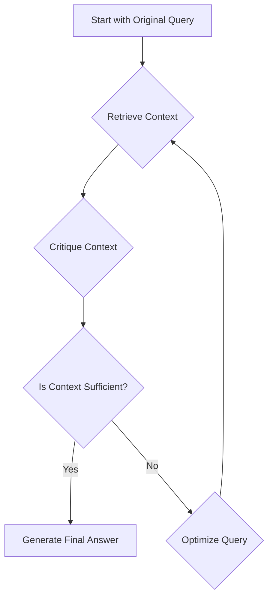
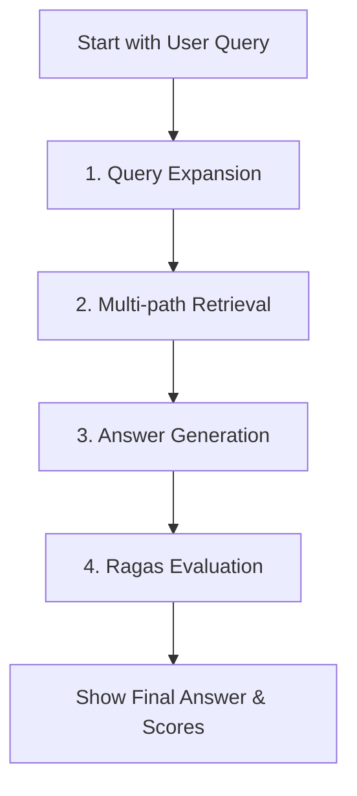

# Week 10: Advanced RAG Patterns - Reflection & Evaluation

This lab explores two sophisticated Retrieval-Augmented Generation (RAG) patterns within the `crewai` framework. We progress from a self-correcting reflective loop to a multi-stage pipeline inspired by production-grade RAG systems, incorporating quantitative evaluation using the `ragas` library.

## Objective

To implement and compare advanced RAG strategies that go beyond simple "retrieve-then-generate" logic, focusing on improving context quality and evaluating the final output.

---

## Method 1: `solution.py` - Self-Reflective RAG Loop

This solution implements a cyclical, reflective RAG process. The core idea is that if the initially retrieved context is insufficient, the system should "reflect" on the failure and retry with an improved query.

### Design & Workflow

The workflow is managed by a controller loop that simulates a "retrieve-critique-optimize" cycle.



1.  **Retriever Agent**: Fetches context from the knowledge base using the current query.
2.  **Critique Agent**: Evaluates the retrieved context against the *original* query, scoring its relevance and sufficiency.
3.  **Query Optimizer Agent**: If the context is deemed insufficient, this agent rewrites the original query based on the critique, aiming for a more effective search in the next iteration.
4.  **Controller Loop**: The `main` function orchestrates this process for a fixed number of retries.

### Key Learnings & Limitations

-   **Strength**: Excellent for scenarios where queries are ambiguous. The reflective loop allows the system to iteratively home in on the user's true intent.
-   **Limitation**: The sequential nature can be slow. Each loop requires multiple LLM calls, increasing latency. It also risks getting stuck in a suboptimal loop if the query optimization is not effective.

---

## Method 2: `solution_advanced.py` - Multi-Stage RAG with Ragas Evaluation

This solution implements a more structured, linear pipeline that mimics state-of-the-art RAG systems. It focuses on enriching the context *before* generation and then quantitatively evaluating the result.

### Design & Workflow

This approach is a four-stage pipeline, where the output of each stage feeds into the next.



1.  **Query Expansion Agent**: Takes the user's unstructured query and generates multiple, diverse sub-queries to cover different facets of the topic.
2.  **Information Retriever Agent**: Executes all sub-queries against the knowledge base and merges the results into a single, comprehensive context.
3.  **Answer Generator Agent**: Synthesizes the final answer based on the rich, merged context.
4.  **Ragas Evaluation**: The script then constructs a `ragas` dataset from the "RAG Triad" (the original query, the generated answer, and the retrieved context) and evaluates it.

### Alignment with Ragas Triad

This pipeline is explicitly designed to be evaluated by `ragas`:

-   `question` (User Query) + `contexts` (Retrieved Context) -> **`ContextRelevance`**: *Is the retrieved context relevant to the query?*
-   `answer` (Final Answer) + `contexts` (Retrieved Context) -> **`Faithfulness`**: *Is the answer grounded in the context?*
-   `answer` (Final Answer) + `question` (User Query) -> **`AnswerRelevancy`**: *Does the answer address the query?*

### Key Learnings & Limitations

-   **Strength**: Highly robust and produces comprehensive answers. The quantitative evaluation provides a clear, objective measure of the pipeline's quality. This architecture is more aligned with production systems.
-   **Limitation**: It's a "one-shot" pipeline. If the initial query expansion and retrieval are poor, there is no built-in mechanism to self-correct.

---

## Method 3: `solution_hyde.py` - Hypothetical Document Embeddings (HyDE)

This solution introduces a third, highly effective RAG strategy: HyDE. The core insight is that a hypothetical answer, generated by an LLM, is often semantically closer to the real answer documents than the original, often brief, user query.

### Design & Workflow

The HyDE workflow replaces the query expansion stage with hypothetical document generation.

```mermaid
graph TD
    A[Start with User Query] --> B[1. Generate Hypothetical Document (HyDE)];
    B --> C[2. Retrieve Real Docs with HyDE];
    C --> D[3. Generate Final Answer];
    D --> E[4. Ragas Evaluation];
    E --> F[Show Final Answer & Scores];
```

1.  **Hypothetical Document Generator Agent**: Takes the original user query and generates a detailed, plausible "fake" answer. This document is rich in keywords, concepts, and structure.
2.  **Information Retriever Agent**: Uses the entire hypothetical document as a search query to find the most semantically similar *real* documents in the knowledge base.
3.  **Answer Generator Agent**: Receives the *real* documents retrieved and the *original* user query to synthesize a final, fact-based answer.
4.  **Ragas Evaluation**: The same evaluation process is applied to the final output.

### Key Learnings & Limitations

-   **Strength**: Extremely effective at overcoming keyword mismatch and improving retrieval precision. The generated hypothetical document acts as a perfect "information scent" to guide the search.
-   **Limitation**: Requires an extra LLM call upfront to generate the document. The quality of the final retrieval is highly dependent on the quality of this initial hypothetical generation.

---

## Comparative Summary

| Strategy                      | `solution.py` (Reflection)                               | `solution_advanced.py` (Expansion)                        | `solution_hyde.py` (HyDE)                                 |
| ----------------------------- | -------------------------------------------------------- | --------------------------------------------------------- | --------------------------------------------------------- |
| **Core Idea**                 | Self-correct through iterative critique and refinement.  | Broaden the search space to get comprehensive context.    | Use a "fake" answer to find a "real" one.                 |
| **Best For**                  | Ambiguous or poorly-defined user queries.                | Complex topics requiring information from multiple angles.| Vague queries where semantic context is key.              |
| **Pros**                      | - Adapts to user intent<br>- High precision in later loops | - Very comprehensive context<br>- High-quality answers      | - Excellent retrieval accuracy<br>- Overcomes keyword mismatch |
| **Cons**                      | - High latency (sequential loops)<br>- Can get stuck        | - One-shot, no self-correction<br>- Can retrieve noise      | - Extra LLM call upfront<br>- Depends on fake doc quality   |
| **Workflow**                  | Cyclical / Looping                                       | Linear / Pipeline                                         | Linear / Pipeline                                         |

## Key Engineering Takeaways from This Lab

1.  **The `CrewOutput` Object**: A recurring lesson. The output of `crew.kickoff()` is a `CrewOutput` object, not a raw string. It **must** be explicitly converted using `str()` before being passed to any function expecting a string (e.g., `json.loads`, `.strip()`, or `ragas`'s `Dataset.from_dict`).

2.  **Modern `crewai` Knowledge Management**: The `KnowledgeBase` class is deprecated. The correct, stable method is to use `TextFileKnowledgeSource` (or other sources) and pass them to the `Crew` object at initialization via the `knowledge_sources` parameter. The agents themselves no longer need a `knowledge_base` parameter.

3.  **Navigating `ragas` API Evolution**: The `ragas` library has undergone significant API changes.
    -   Metrics are now **classes** (e.g., `ContextRelevance`, `Faithfulness`) that must be imported from `ragas.metrics` and **instantiated** (e.g., `ContextRelevance()`) when passed to `evaluate`.
    -   The `evaluate` function requires an explicit `llm` instance to perform its evaluations (e.g., `llm=ChatOpenAI(...)`).
    -   Metric requirements are strict. We switched from `ContextPrecision` to `ContextRelevance` because the former requires a `reference` (ground truth) column in the dataset, while the latter is designed for reference-free evaluation.

4.  **Structured RAG Pipelines**: By breaking down the RAG process into discrete, specialized agents (expand, retrieve, generate, evaluate), we can build more powerful, debuggable, and extensible systems than a single monolithic agent.
