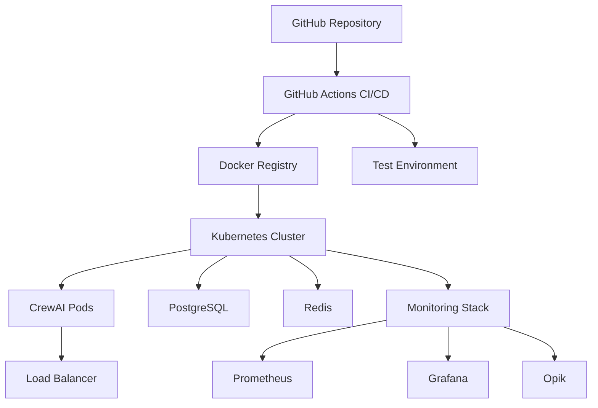

# Week 14: CrewAI 容器化與 CI/CD 部署

> **目標**: 實作 CrewAI 應用的容器化、Kubernetes 部署和完整的 CI/CD 流程

## 📋 概述

本週我們將學習如何將 CrewAI 應用程式部署到生產環境，包括：
- **Docker 容器化**: 建立高效、安全的容器映像
- **Kubernetes 部署**: 可擴展的微服務架構
- **CI/CD 管道**: 自動化測試、建構和部署流程
- **監控與觀測**: 整合 Prometheus、Grafana 和 Opik

### 🏗️ 架構概覽



## 🏗️ 專案結構

```
week14_deployment/
├── README.md                    # 本文件
├── docker/                      # Docker 相關文件
│   ├── Dockerfile              # 主應用容器化文件
│   ├── docker-compose.yml      # 開發環境編排
│   ├── init.sql                # 資料庫初始化腳本
│   └── prometheus.yml          # Prometheus 設定
├── kubernetes/                  # Kubernetes 部署文件
│   ├── namespace.yaml          # 命名空間和設定
│   ├── postgres.yaml           # PostgreSQL 部署
│   ├── redis.yaml              # Redis 部署
│   └── crewai-app.yaml         # 主應用部署
├── github_actions/             # CI/CD 管道
│   └── ci-cd.yml              # GitHub Actions 工作流程
└── examples/                   # 示例應用
    └── simple_api.py          # 可部署的 FastAPI 示例
```

## 🚀 快速開始

### 1. 本地開發環境

```bash
# 使用 Docker Compose 啟動完整的開發環境
cd work/labs/week14_deployment/docker
docker-compose up -d

# 查看服務狀態
docker-compose ps

# 查看日誌
docker-compose logs -f crewai-app
```

**服務訪問**：
- CrewAI API: http://localhost:8000
- API 文檔: http://localhost:8000/docs
- PostgreSQL: localhost:5432
- Redis: localhost:6379
- Opik UI: http://localhost:5173
- Prometheus: http://localhost:9090
- Grafana: http://localhost:3000 (admin/admin)

### 2. 建構 Docker 映像

```bash
# 從專案根目錄建構映像
docker build -f work/labs/week14_deployment/docker/Dockerfile -t crewai:latest .

# 執行容器
docker run -p 8000:8000 \
  -e OPENAI_API_KEY=$OPENAI_API_KEY \
  -e TAVILY_API_KEY=$TAVILY_API_KEY \
  crewai:latest
```

### 3. Kubernetes 部署

```bash
# 部署到 Kubernetes 集群
kubectl apply -f work/labs/week14_deployment/kubernetes/

# 檢查部署狀態
kubectl get pods -n crewai
kubectl get services -n crewai

# 查看應用日誌
kubectl logs -f deployment/crewai-app -n crewai
```

## 🐳 Docker 容器化

### 多階段建構優化

我們的 Dockerfile 使用多階段建構來優化映像大小和安全性：

```dockerfile
# 建構階段 - 安裝依賴
FROM python:3.11-slim AS builder
# ... 安裝 uv 和依賴

# 生產階段 - 最小化映像
FROM python:3.11-slim AS production
# ... 複製虛擬環境和應用程式碼
```

**特色**:
- 🔒 非 root 使用者執行
- 📦 多平台支援 (AMD64, ARM64)
- 🏥 健康檢查機制
- 📊 內建指標端點

### 開發環境編排

`docker-compose.yml` 提供完整的開發堆疊：
- **CrewAI 應用**: 主要服務
- **PostgreSQL**: 關聯式資料庫
- **Redis**: 快取和任務佇列
- **Opik**: 本地觀測平台
- **Prometheus**: 指標收集
- **Grafana**: 視覺化儀表板
- **ChromaDB**: 向量資料庫

## ☸️ Kubernetes 部署

### 生產就緒特性

#### 1. 安全性
```yaml
securityContext:
  runAsNonRoot: true
  runAsUser: 1000
  allowPrivilegeEscalation: false
  readOnlyRootFilesystem: true
```

#### 2. 資源管理
```yaml
resources:
  requests:
    memory: "512Mi"
    cpu: "500m"
  limits:
    memory: "1Gi"
    cpu: "1000m"
```

#### 3. 自動擴展
```yaml
# HPA 設定
minReplicas: 3
maxReplicas: 10
metrics:
- type: Resource
  resource:
    name: cpu
    target:
      averageUtilization: 70
```

#### 4. 健康檢查
```yaml
livenessProbe:
  httpGet:
    path: /health
    port: 8000
readinessProbe:
  httpGet:
    path: /ready
    port: 8000
```

### 部署組件

| 組件 | 副本數 | 用途 |
|------|-------|------|
| crewai-app | 3-10 | 主要應用服務 |
| postgres | 1 | 關聯式資料庫 |
| redis | 1 | 快取和佇列 |

## 🔄 CI/CD 管道

### GitHub Actions 工作流程

```yaml
# 觸發條件
on:
  push:
    branches: [ main, develop ]
  pull_request:
    branches: [ main ]
  release:
    types: [ published ]
```

### 管道階段

#### 1. **測試階段**
- 程式碼品質檢查 (Black, Flake8, MyPy)
- 安全掃描 (Bandit, Safety)
- 單元測試和覆蓋率
- 多 Python 版本測試

#### 2. **建構階段**
- Docker 映像建構
- 多平台支援 (AMD64, ARM64)
- 映像推送到 GitHub Container Registry
- 映像標籤和元數據

#### 3. **安全掃描**
- Trivy 漏洞掃描
- SARIF 報告上傳
- 安全報告整合

#### 4. **部署階段**
- **Staging**: 自動部署 develop 分支
- **Production**: 手動部署 release 標籤
- 煙霧測試和健康檢查

### 環境管理

| 環境 | 觸發條件 | 網址 |
|------|----------|------|
| Staging | `develop` 分支 | https://staging.crewai.yourdomain.com |
| Production | Release 發布 | https://crewai.yourdomain.com |

## 📊 監控與觀測

### 指標收集

應用程式內建 Prometheus 指標：

```python
# 請求指標
REQUEST_COUNT = Counter('crewai_requests_total', 'Total requests')
REQUEST_DURATION = Histogram('crewai_request_duration_seconds', 'Request duration')

# 業務指標
CREW_EXECUTIONS = Counter('crewai_crew_executions_total', 'Total crew executions')
CREW_DURATION = Histogram('crewai_crew_duration_seconds', 'Crew execution duration')
```

### 關鍵指標

- **可用性**: 服務健康狀態和響應時間
- **效能**: 請求延遲和吞吐量
- **錯誤率**: HTTP 錯誤和應用程式異常
- **資源使用**: CPU、記憶體和磁碟使用率
- **業務指標**: Crew 執行次數和成功率

### 告警規則

建議的告警閾值：
- HTTP 錯誤率 > 5%
- 平均回應時間 > 2 秒
- CPU 使用率 > 80%
- 記憶體使用率 > 90%

## 🛠️ 運維指南

### 常見操作

#### 檢查部署狀態
```bash
# Kubernetes 健康檢查
kubectl get pods -n crewai
kubectl describe pod <pod-name> -n crewai

# 查看應用日誌
kubectl logs -f deployment/crewai-app -n crewai

# 檢查服務端點
kubectl get endpoints -n crewai
```

#### 擴展應用
```bash
# 手動擴展
kubectl scale deployment crewai-app --replicas=5 -n crewai

# 檢查 HPA 狀態
kubectl get hpa -n crewai
```

#### 更新部署
```bash
# 滾動更新
kubectl set image deployment/crewai-app crewai-app=crewai:v1.1.0 -n crewai

# 檢查更新狀態
kubectl rollout status deployment/crewai-app -n crewai

# 回滾到上一版本
kubectl rollout undo deployment/crewai-app -n crewai
```

### 故障排除

#### 1. Pod 無法啟動
```bash
# 檢查 Pod 狀態和事件
kubectl describe pod <pod-name> -n crewai

# 檢查映像拉取問題
kubectl get events -n crewai --sort-by='.lastTimestamp'
```

#### 2. 服務無法訪問
```bash
# 檢查服務和端點
kubectl get svc,endpoints -n crewai

# 測試服務連接
kubectl run test-pod --image=busybox --rm -it -- wget -qO- http://crewai-service/health
```

#### 3. 資料庫連接問題
```bash
# 檢查 PostgreSQL Pod
kubectl logs deployment/postgres -n crewai

# 測試資料庫連接
kubectl run db-test --image=postgres:15-alpine --rm -it -- psql -h postgres-service -U crewai -d crewai_db
```

## 🔧 自訂與擴展

### 新增服務

要新增新的微服務：

1. 建立 Kubernetes 部署文件
2. 更新 `docker-compose.yml`
3. 修改 CI/CD 管道
4. 新增監控指標

### 環境變數管理

使用 Kubernetes Secrets 和 ConfigMaps：

```bash
# 建立 Secret
kubectl create secret generic api-keys \
  --from-literal=openai-key="your-key" \
  --from-literal=tavily-key="your-key" \
  -n crewai

# 建立 ConfigMap
kubectl create configmap app-config \
  --from-literal=environment="production" \
  --from-literal=log-level="info" \
  -n crewai
```

## 📚 參考資源

### 官方文件
- [Docker 最佳實踐](https://docs.docker.com/develop/dev-best-practices/)
- [Kubernetes 部署指南](https://kubernetes.io/docs/concepts/workloads/controllers/deployment/)
- [GitHub Actions 文件](https://docs.github.com/en/actions)

### 工具和平台
- [Prometheus 監控](https://prometheus.io/docs/)
- [Grafana 儀表板](https://grafana.com/docs/)
- [Opik 觀測平台](https://www.comet.com/docs/opik/)

### 安全資源
- [容器安全最佳實踐](https://kubernetes.io/docs/concepts/security/)
- [OWASP 容器安全指南](https://owasp.org/www-project-docker-top-10/)

## 🎯 學習目標檢核

完成本週學習後，你應該能夠：

- [ ] 建立生產就緒的 Docker 映像
- [ ] 設計可擴展的 Kubernetes 架構
- [ ] 實施完整的 CI/CD 管道
- [ ] 配置監控和告警系統
- [ ] 執行常見的運維操作
- [ ] 排除部署相關問題

## 🚀 下一步

完成本週學習後，建議：

1. 探索更進階的 Kubernetes 功能（Helm Charts、Operators）
2. 學習服務網格技術（Istio、Linkerd）
3. 研究 GitOps 部署模式（ArgoCD、Flux）
4. 實踐多雲部署策略
5. 深入容器安全和合規性

---

**💡 提示**: 生產部署需要考慮安全性、可靠性和可維護性。從簡單的設置開始，逐步增加複雜性，並始終遵循最佳實踐。